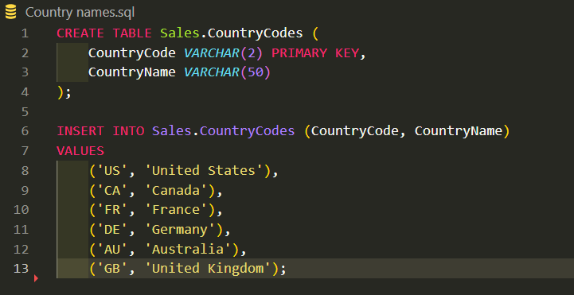
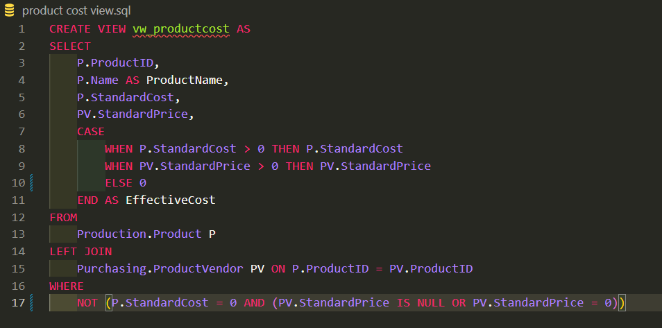
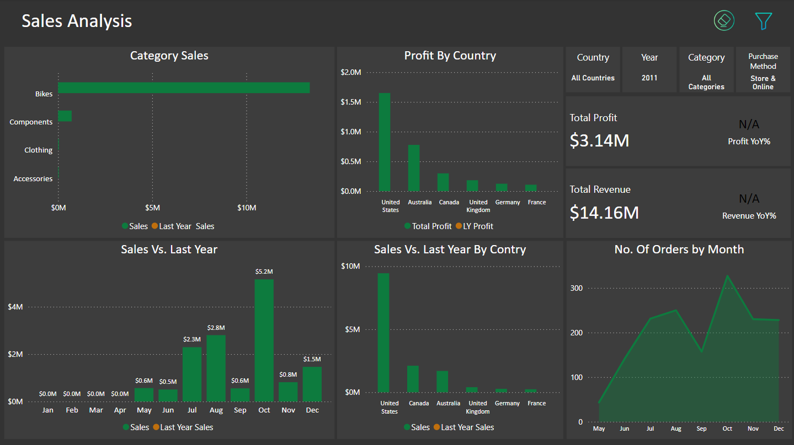
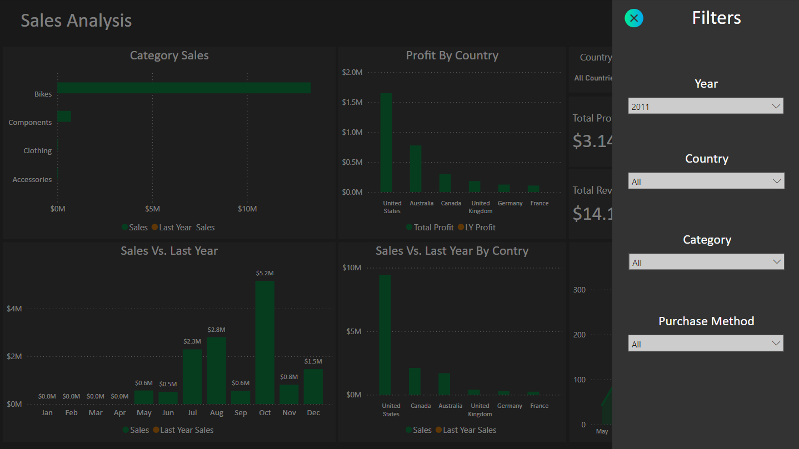
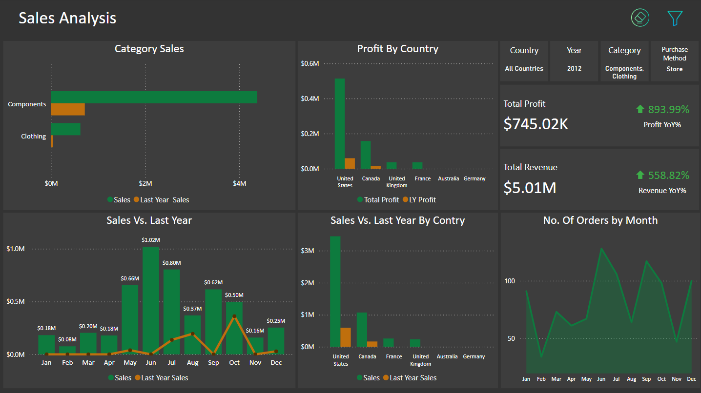
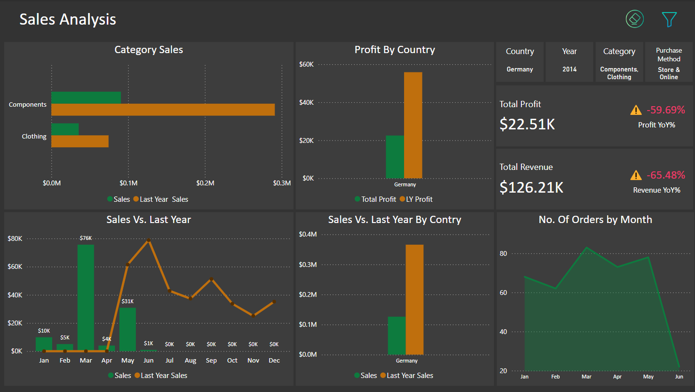
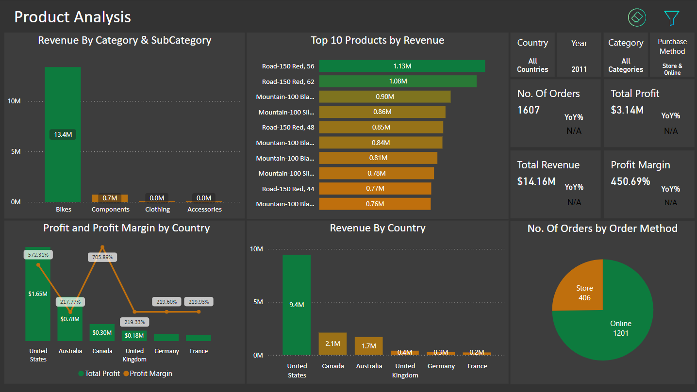
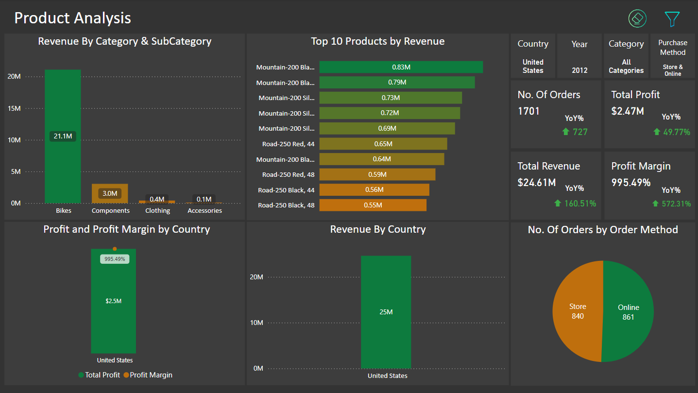
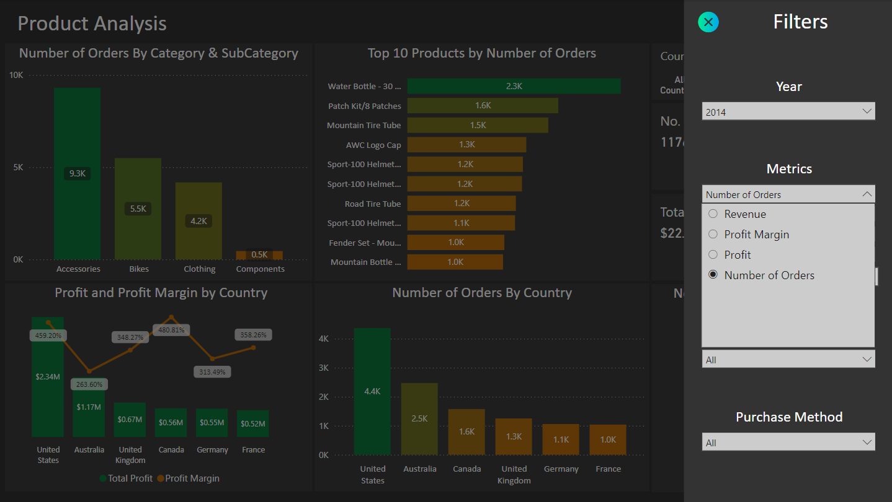
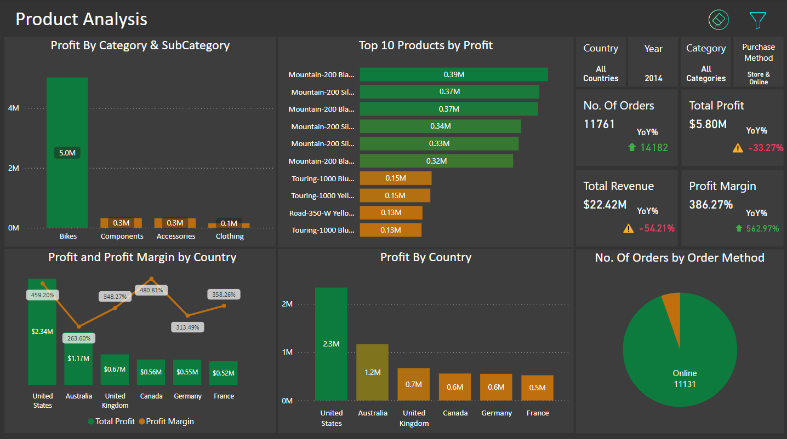

# Adventure Works Sales Analysis

This is an Adventure Works Sales Analysis project that focuses on extracting valuable insights from the AdventureWorks database, a fictional company specializing in bicycles and related products. 

To facilitate the analysis, a **star schema** was designed, optimizing the data model for efficient querying and reporting. The source of the data is the **AdventureWorks2022 database**, which provides a rich dataset of sales, products, customers, and employees, enabling a realistic business analysis experience.

The analysis leverages **SQL and Power BI** to uncover insights into sales performance, customer behavior, and product profitability. The dashboard is designed to provide a comprehensive overview of key metrics, such as sales by product, regional performance, and profitability. It aims to assist in making data-driven business decisions with intuitive visualizations and interactive elements.

## About Adventure Works

AdventureWorks is a fictitious company that manufactures and sells bicycles and accessories. The database is widely used as a sample dataset for data analysis projects, providing data at scale for realistic business analysis.

Feel free to explore the visualizations and insights in this repository!

## Project Objectives

- To analyze sales data to identify trends and performance across different products, customers, and regions.
- To visualize key insights using interactive dashboards.
- To derive actionable insights that could enhance decision-making processes.

## Tools & Technologies

- **SQL**: For querying and analyzing the AdventureWorks dataset.
    ##### **SQL Queries for Database Understanding and Visualization**

    To further understand the AdventureWorks2022 database and facilitate the visualization process, I wrote several SQL queries. These queries helped me gain insights into the data structure and relationships.

    #### Queries
    
    
---

- **Data Transformation**: 
    - Implemented within Power BI using Power Query.
    - Data Modelling :
    

---

- **Power BI**: To create interactive dashboards to showcase insights.

## Dashboard Features
### 1. **Sales**

- **Categories Revenue**: Displays the revenue generated from different categories, providing insight into which categories are the most profitable.
- **Profit By Country**: Shows a comparison of total profits by country, highlighting where the business is most successful.
- **Total Profit**: A summary card that indicates the total profit amount, giving a quick snapshot of overall financial performance.
- **Year Over Year (YoY) Growth**: A metric card showing the percentage growth in profit compared to the previous year, indicating business growth rate.

**Detailed Analysis**

- **Sales vs. Last Year**: Compares current sales with those from the previous year on a monthly basis, illustrating trends and growth patterns.
- **Sales vs. Last Year by Country**: Breaks down sales comparison with the previous year by country, allowing for regional performance analysis.

**Performance Metrics**
Performance Metrics

- **No. Of Orders by Month**: A line graph that tracks the number of orders each month, useful for identifying demand fluctuations and seasonal trends.

**Filters Applied**
Filters Applied

This section includes four cards indicating active filters:
   - *Country*: Shows which country's data is being displayed.
   - *Year*: Indicates the year for which data is being analyzed.
   - *Category*: Specifies product category filters applied to data.
   - *Purchase Method*: Specifies purchase method filter applied to data.

**Adding a Filter Pane** 

- **Optimized Space**: By adding a filter pane, the dashboard can optimize space, allowing users to selectively view data that is most relevant to them.
- **Enhanced User Experience**: The filter pane declutters the visual space and enhances user experience by providing targeted insights without overwhelming them with all available data simultaneously.
- **Customizable Filters**: Users can apply filters such as Year, Country, Category, and Purchase Method to tailor the data displayed according to their specific needs.

After applying different filters, the cards on the dashboard dynamically update to reflect the selected criteria, such as specific countries, years, categories, or purchase methods. This ensures that the displayed data is relevant and tailored to the user's needs, providing a clear and focused view of the filtered information.

---

### 2. **Products**

- **Revenue by Category & SubCategory**: A bar graph showing the revenue generated by each category and subcategory.
- **Top 10 Products by Revenue**: A horizontal bar graph listing the top 10 products by revenue.
- **Key Performance Indicators (KPIs)**: Displays total revenue, total profit, number of orders, and profit margin for the year 2011.
- **Profit and Profit Margin by Country**: A pie chart comparing profit and profit margin by country.
- **Revenue by Country**: A pie chart showing revenue by country.
- **No. of Orders by Order Method**: A donut chart displaying the number of orders by different order methods.
- **Optimized Space and Consistent Features**: Just like the sales dashboard, the products page includes a filter pane, optimizing space and allowing users to selectively view relevant data. Additionally, a metric filter enables switching between various metrics (profit margin, profit, revenue, and units sold), saving space and providing more information within the same page.
- **Enhanced User Experience**: The filter pane declutters the visual space, enhancing user experience by allowing users to focus on targeted insights without being overwhelmed by unnecessary data.
- **Customizable Filters**: Users can apply filters such as Year, Country, Category, Purchase Method, and the metric filter to customize the data displayed according to their specific needs.

By applying different filters, the cards on the dashboard dynamically update to reflect the selected criteria, ensuring that the displayed data is always relevant, tailored, and offers a clear view of the filtered information.

## Conclusion for Analysis

- **Touring Bikes Performance**: Despite having a higher profit margin, touring bikes exhibited the lowest profit and revenue among all product categories.
- **Order Trends**: There is a consistent decrease in the number of orders in February, although the decline is not significant. Conversely, there is a steady increase in orders during November and December, likely due to the holiday season, as well as in June and July, which can be attributed to the onset of summer.
- **Seasonal Sales Patterns**: A clear trend emerges in all years, showing increased sales in the third and fourth quarters, suggesting strong seasonal demand during this period.
- **Impact of Data Gaps**: The year 2014 experienced a substantial drop in sales attributed to missing data for certain months. Nevertheless, preliminary indicators suggested that it was on track to generate higher profits than the previous year.
- **Top Selling Product**: The DWC cap is the top-selling product; however, it does not contribute significantly to overall profit margins.
- **Geographical Insights**: The United States and Australia lead in total sales and profit; however, other countries, particularly Canada, exhibit higher profit margins.

## How to Use

1. **Filter Data**: Use the slicers to filter data by year, product, city, and other dimensions to focus on specific areas of interest.
2. **Interactive Insights**: Click on different parts of the visualizations to explore more detailed data and see how various metrics correlate.

## Installation and Setup

1. Download and install [Power BI Desktop](https://powerbi.microsoft.com/desktop/).
2. Open the `.pbix` file provided with this project.
3. Refresh the data connections to load the most recent data.
4. Explore the dashboard and customize it based on your specific analysis needs.