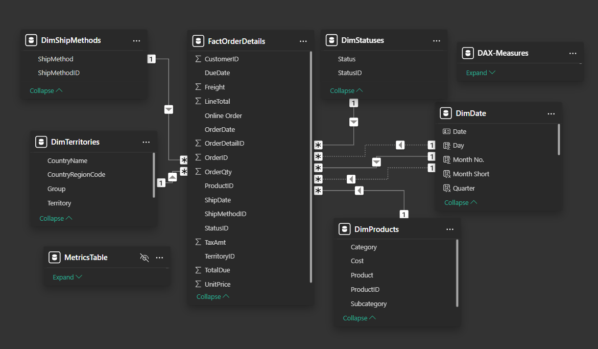

# Adventure Works Sales Analysis

This project focuses on extracting valuable insights from the **AdventureWorks2022** database, a sample dataset representing a fictional company that manufactures and sells bicycles and related products. Using a **star schema** for optimized data querying and leveraging **SQL and Power BI**, this analysis reveals insights into sales performance, customer behavior, and product profitability.

---

## About Adventure Works

AdventureWorks is a fictitious company that manufactures bicycles and accessories. Its database is widely used for data analysis projects, providing realistic business analysis scenarios at scale.

---

## Project Objectives

- To analyze sales data to identify trends and performance across different products, customers, and regions.
- To visualize key insights using interactive dashboards.
- To derive actionable insights that could enhance decision-making processes.

---

## Tools & Technologies

- **SQL**: For querying and analyzing the AdventureWorks dataset.

### SQL Queries for Database Understanding and Visualization

To better understand the AdventureWorks2022 database and facilitate the visualization process, several SQL queries were written to gain insights into the data structure and relationships.

#### Sample Queries

---

- **Data Transformation**: 
    - Implemented in Power BI using Power Query.
    - **Data Modeling**:

---

- **Power BI**: For creating interactive dashboards to showcase insights.

---

## Dashboard Features

### 1. **Sales Dashboard**

#### Key Visualizations

- **Categories Revenue**: Shows the revenue generated from different categories, identifying the most profitable ones.
- **Profit by Country**: Highlights profit comparison by country, helping to identify the most successful regions.
- **Total Profit**: Displays the overall profit for quick financial performance review.
- **Year Over Year (YoY) Growth**: Displays YoY growth in profit as a percentage, tracking business growth.

#### Detailed Analysis

- **Sales vs. Last Year**: Compares monthly sales with the previous year, helping spot growth trends.
- **Sales vs. Last Year by Country**: A regional breakdown of sales comparisons with the previous year.

#### Performance Metrics

- **No. Of Orders by Month**: A line graph tracking the number of orders monthly, useful for understanding demand fluctuations and seasonal trends.

#### Filters Applied

A section with four cards displaying active filters:
   - **Country**: Specifies which country's data is shown.
   - **Year**: Indicates the selected year for data analysis.
   - **Category**: Specifies product categories being filtered.
   - **Purchase Method**: Shows the purchase method used for data filtering.

#### Filter Pane

- **Optimized Space**: The filter pane optimizes space and helps users focus on relevant data.
- **Enhanced User Experience**: Declutters visuals and ensures more targeted insights.
- **Customizable Filters**: Users can apply filters like Year, Country, Category, and Purchase Method.

After applying filters, the dashboard dynamically updates to show relevant, filtered information.

---

### 2. **Products Dashboard**

#### Key Visualizations

- **Revenue by Category & SubCategory**: Displays the revenue generated by each category and subcategory.
- **Top 10 Products by Revenue**: A horizontal bar graph of the top 10 products by revenue.
- **Key Performance Indicators (KPIs)**: Includes total revenue, total profit, number of orders, and profit margin for 2011.
- **Profit and Profit Margin by Country**: A column and line chart comparing profit and profit margins by country.
- **Revenue by Country**: A column chart showing revenue by country.
- **No. of Orders by Order Method**: A pie chart showing the number of orders by different order methods.

#### Filter Pane and Metrics

Similar to the sales dashboard, the products dashboard features a filter pane and a metric filter, allowing users to switch between metrics (e.g., profit margin, profit, revenue, units sold). This saves space while providing detailed information on a single page.

---

## Conclusion of the Analysis

- **Touring Bikes Performance**: Touring bikes, despite their higher profit margin, generated the lowest profit and revenue.
- **Order Trends**: A consistent drop in February orders, contrasted with increased orders in November and December due to the holiday season.
- **Seasonal Sales Patterns**: Strong sales growth in the third and fourth quarters, suggesting seasonality.
- **Impact of Data Gaps**: Sales in 2014 dropped due to missing data for certain months, but indicators suggest higher potential profits than 2013.
- **Top Selling Product**: The DWC cap is the top-selling product but does not significantly contribute to profit margins.
- **Geographical Insights**: The United States and Australia lead in total sales and profits, but Canada shows higher profit margins.

---

## How to Use

1. **Filter Data**: Use slicers to filter by year, product, city, and other dimensions.
2. **Interactive Insights**: Click on different visualizations to explore detailed data.

---

## Installation and Setup

1. Download and install [Power BI Desktop](https://powerbi.microsoft.com/desktop/).
2. Open the `.pbix` file provided with this project.
3. Refresh data connections to load the latest data.
4. Explore and customize the dashboard as per your analysis needs.
